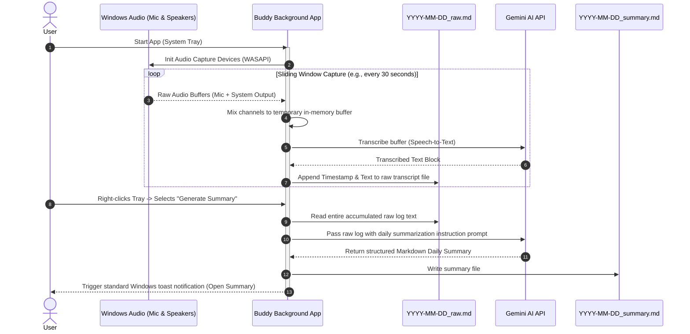

# Product Requirements Document (PRD)
## Project Name: Buddy
**Version:** 1.1.0  
**Status:** Approved  
**Target Platform:** Windows 10/11 (x64)

---

## 1. Executive Summary & Product Vision

For professionals juggling back-to-back virtual meetings, spontaneous brainstorms, and task lists, manually capturing details is a major distraction.

**Buddy** is a completely passive, always-on background assistant for Windows. Operating silently in the system tray, it continuously listens to both the user's microphone and system audio (speakers). Rather than requiring manual session segmentation or hotkey commands, Buddy operates entirely through natural audio stream capturing. 

Buddy captures audio in continuous, lightweight buffers, transcribes them, and instantly appends the timestamped transcription to a local, human-readable **Markdown (`.md`)** raw transcript log. Users speak transition markers and hints naturally (e.g., *"Buddy, the next meeting is about the frontend redesign"*). At the end of the day, or upon direct user request, Buddy passes this consolidated raw Markdown transcript to Gemini to perform comprehensive timeline segmentation, extract spontaneous ideas, and compile a structured, action-oriented executive digest.

---

## 2. Core Features & Capabilities

### F01: Passive Dual-Channel Audio Capture
*   **Description:** Buddy continuously records sound from the physical microphone input and the computer's system audio (speakers) via native Windows WASAPI loopback, without requiring virtual audio cables.
*   **Requirements:**
    *   Treats audio capture as a unified, continuous background recording stream.
    *   Operates with minimal CPU and memory overhead, running silently in the system tray.
    *   Gracefully handles silent periods without dropping the capture connection.

### F02: Continuous Direct-to-Markdown Transcript Logging
*   **Description:** Rather than storing large, raw audio recordings on disk or cutting files into complicated chunks, Buddy transcribes sliding audio windows (e.g., every 30 seconds) and appends the text directly to a local Markdown file.
*   **Requirements:**
    *   **Log Storage Path:** Saved in the user's home directory:  
        `%USERPROFILE%\.buddy\transcripts\YYYY-MM-DD_raw.md`
    *   **Append Operation:** Every 30-second mixed audio buffer is transcribed (using a lightweight speech-to-text service or Gemini inline requests) and appended instantly in the following format:
        ```markdown
        ### [21:15:30]
        We need to make sure the database is migrated to PostgreSQL.
        ```
    *   **Crash Resilience:** Appending directly to a standard text/markdown file ensures that even during a power loss or crash, the transcript up to the last 30 seconds is safely persisted.

### F03: Natural Spoken Cues
*   **Description:** There are no hotkeys, popups, or HUD GUI components. The user interacts with Buddy entirely by speaking naturally at any point.
*   **Requirements:**
    *   The user can inject session hints or context markers simply by verbalizing them:  
        *"Buddy, starting the standup meeting now."* or *"Buddy, spontaneous idea: let's automate the deployment pipeline."*
    *   These cues are captured and written directly to the continuous Markdown log file.

### F04: On-Demand & End-of-Day Digest Generation
*   **Description:** Decoupled from the recording loop, the daily summary is generated when the user selects "Generate Summary" in the tray menu or automatically at the end of the day.
*   **Requirements:**
    *   **Compilation Prompt:** Buddy reads the active daily raw Markdown log (`YYYY-MM-DD_raw.md`) and sends it to Gemini (e.g., `gemini-1.5-pro` or `gemini-1.5-flash`) along with an analytical prompt instruction.
    *   **Semantic Synthesis:** Gemini parses the spoken cues, segments the day's timeline, classifies conversational contexts, and extracts key spontaneous ideas.
    *   **Output File:** Saved directly in the user's visible folder:  
        `%USERPROFILE%\.buddy\summaries\YYYY-MM-DD_summary.md`
    *   **Structure of Output:**
        *   **Executive Daily Summary:** High-level narrative of the day's activities.
        *   **Segmented Meeting Timeline:** Automatically grouped sections based on detected spoken cues.
        *   **Action Items & Ownership Matrix:** Bulleted lists of tasks, owners, and priority.
        *   **Spontaneous Ideas Vault:** Curated brainstorm points and spoken thoughts.

---

## 3. User Interface & User Experience (UI/UX)

To keep Buddy distraction-free, the application has **no standard main window interface**. It is designed to be 100% passive:

### 3.1. System Tray Icon & Control Menu
*   **Visual Design:** Simple icon in the Windows taskbar signifying recording state (Active/Listening, Paused, Processing).
*   **Menu Options:**
    *   `Resume / Pause Listening`
    *   `Generate Summary (On-Demand)`
    *   `Open Transcripts Directory` (Opens `%USERPROFILE%\.buddy\transcripts\`)
    *   `Open Summaries Directory` (Opens `%USERPROFILE%\.buddy\summaries\`)
    *   `Settings` (Configure API Keys, toggle audio input devices)
    *   `Exit`

### 3.2. Native Windows Notifications
*   **Description:** Instead of complex in-app popups, Buddy uses standard Windows toast notifications to communicate state changes:
    *   *Notification 1:* *"Buddy is now active and listening in the background."*
    *   *Notification 2:* *"Summary generated successfully! Saved to .buddy\summaries."*

---

## 4. Sequence & Data Flow



---

## 5. Security & Privacy

Since Buddy records conversations continuously, strict privacy protocols are followed:
1.  **Local Storage:** Raw audio chunks are processed entirely in-memory or in short-lived temp buffers, then sent securely to the Gemini API for translation. No long-term raw audio files are stored locally, saving disk space and keeping voice files private.
2.  **Plain-Text Transparency:** Storing raw transcripts in plain Markdown allows the user to open, edit, or purge portions of their raw log file at any point before requesting summaries.
3.  **API Key Safety:** Keys are securely stored in the Windows Credential Manager.
