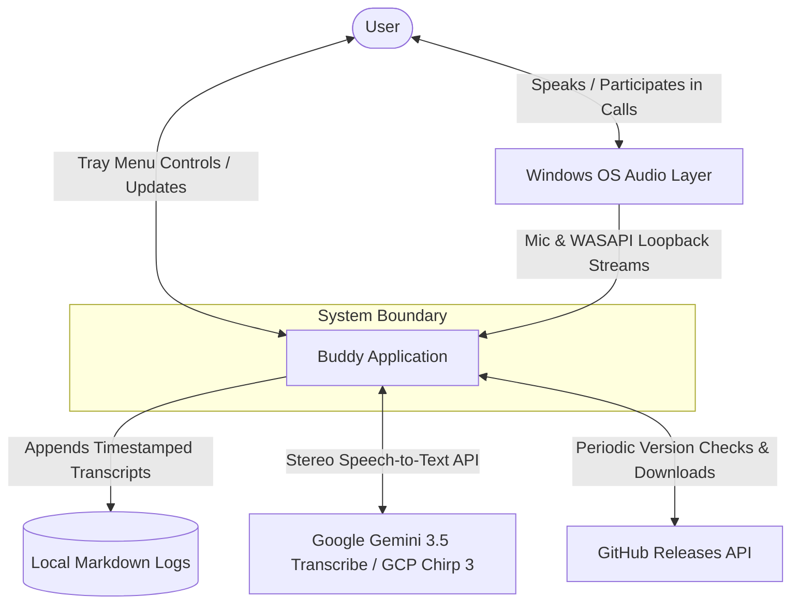
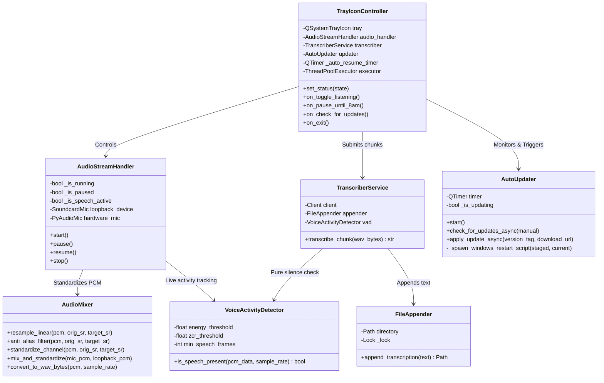

# System Design Specification (C4 Model)
## Project Name: Buddy
**Architectural Pattern:** C4 Architecture Model & Concurrent Threading  
**Status:** Implemented & Verified  
**Target Platform:** Windows 10 / 11 (x64)

---

## 1. Introduction

This document provides a detailed system design specification for **Buddy**, a continuous, passive background audio recorder and speaker-attributed transcriber for Windows. This architecture is modeled after the **C4 software architecture model** (Context, Containers, Components, Code interfaces) along with its concurrent multi-threaded execution model.

---

## 2. Level 1: System Context (C1)

The System Context diagram details how **Buddy** integrates with the user, local Windows hardware, and external services.



### System Context Entities
*   **User:** Speaks through their physical microphone and listens to virtual meetings/speakers. Interacts with Buddy via the system tray icon for controls (Pause, Resume, Pause Until 8am, Updates, Open Transcripts).
*   **Windows OS Audio Layer:** Core Audio / WASAPI layer providing hardware microphone input (Input) and active system audio loopback (Output).
*   **Buddy Application:** Background process managing concurrent dual-stream audio capture, anti-aliased resampling, Voice Activity Detection, cloud transcription, and auto-updating.
*   **Local Markdown Logs:** Files stored in `%USERPROFILE%\.buddy\transcripts\YYYY-MM-DD_raw.md`.
*   **Google Gemini AI API / GCP Speech-to-Text:** Remote speech recognition services transcribing stereo audio chunks with speaker attribution tags (`[Me]` vs `[Others]`). Configurable via `GEMINI_MODEL` (default `gemini-3.5-transcribe`).
*   **GitHub Releases API:** Remote version repository providing automated update discovery, asset download, and binary verification.

---

## 3. Level 2: Containers (C2)

The Container diagram decomposes the Buddy application boundary into executable, storage, and networking layers.

```mermaid
graph TB
    subgraph Client Workstation (Windows)
        subgraph Buddy App Process [Buddy Background Process]
            UI[Tray UI Container - PySide6]
            Engine[Audio Core Container - Dual WASAPI Threads]
            VAD[VAD Filter Container - RMS / ZCR Analysis]
            Client[AI Transcriber Container - google-genai / GCP STT]
            Updater[Auto-Updater Container - GitHub API & Worker]
        end
        
        Disk[(User Home ~/.buddy Store)]
    end

    subgraph Remote Services
        Gemini[Google Gemini 3.5 Transcribe API]
        GitHub[GitHub Releases API]
    end

    %% Interactions
    UI -->|Launches & Controls| Engine
    Engine -->|Feeds Raw PCM Chunks| VAD
    VAD -->|Active Speech WAV Bytes| Client
    Client -->|Sends Stereo Audio| Gemini
    Gemini -->|Returns Attributed Text| Client
    Client -->|Thread-safe Markdown Append| Disk
    Updater -->|Checks & Downloads New Versions| GitHub
    Updater -->|Spawns Detached Swap Helper| Disk
```

### Container Responsibilities
1.  **Tray UI Container (PySide6):** Manages the Qt event loop, renders dynamic procedural tray icons (Sleeping, Active, Paused), binds context menu actions, and displays native Windows toast notifications.
2.  **Audio Core Container (Dual WASAPI Threads):** Two dedicated capture threads collecting samples from hardware microphone and system loopback simultaneously without blocking each other.
3.  **VAD Filter Container (Voice Activity Detection):** Evaluates multi-channel RMS energy and Zero-Crossing Rate across 30ms frames, filtering out acoustic clicks, hums, and pure silence.
4.  **AI Transcriber Container (`google-genai` / `google-cloud-speech`):** Converts standardized 16kHz stereo WAV buffers (Left=Me, Right=Others) into speaker-attributed transcript blocks.
5.  **Auto-Updater Container (`requests` / PowerShell helper):** Checks GitHub Releases hourly, downloads new binaries with real-time progress, and executes atomic in-place binary swapping via detached PowerShell script.
6.  **User Home `.buddy` Store:** Stores `config.json` and timestamped transcript logs in `%USERPROFILE%\.buddy\transcripts\`.

---

## 4. Level 3: Components (C3)

The Component diagram breaks down the internal elements of the **Buddy App Process**.



### Thread Safety & Concurrency Model
*   **Main GUI Thread (PySide6 Event Loop):** Handles system tray rendering, user clicks, smart pause timers, and toast notifications.
*   **Mic Capture Thread & Loopback Capture Thread:** Independent worker threads reading WASAPI frames continuously to eliminate buffer underruns.
*   **Threaded VAD & Standardizer:** Operates on in-memory numpy buffers with zero disk I/O.
*   **Transcription Executor (`ThreadPoolExecutor`):** Asynchronously dispatches network HTTP requests to Gemini / GCP, ensuring physical recording is never blocked.
*   **File Mutex (`FileAppender._lock`):** Thread-safe mutex around append operations to guarantee log integrity.

---

## 5. Level 4: Code Interfaces (C4)

### 5.1. Dual-Channel Stereo Audio Mixer Interface
```python
class AudioMixer:
    @staticmethod
    def mix_and_standardize(
        mic_pcm: np.ndarray,
        loopback_pcm: np.ndarray,
        mic_sr: int,
        loopback_sr: int,
        target_sr: int = 16000
    ) -> np.ndarray:
        """
        Resamples both channels to target_sr and arranges into a 2-channel stereo array:
        - Channel 0 (Left): Microphone ("Me")
        - Channel 1 (Right): WASAPI Loopback ("Others")
        """
        std_mic = AudioMixer.standardize_channel(mic_pcm, mic_sr, target_sr)
        std_loop = AudioMixer.standardize_channel(loopback_pcm, loopback_sr, target_sr)
        
        max_len = max(len(std_mic), len(std_loop))
        padded_mic = np.pad(std_mic, (0, max_len - len(std_mic)))
        padded_loop = np.pad(std_loop, (0, max_len - len(std_loop)))
        
        stereo = np.column_stack((padded_mic, padded_loop)).astype(np.float32)
        return stereo
```

### 5.2. Voice Activity Detection Interface
```python
class VoiceActivityDetector:
    def is_speech_present(self, pcm_data: np.ndarray, sample_rate: int = 16000) -> bool:
        """
        Performs frame-by-frame energy and Zero Crossing Rate analysis across 30ms frames
        on all audio channels to verify active human speech.
        """
        # Evaluates RMS energy, ZCR distribution, and consecutive speech frame counts
        ...
```

---

## 6. Comprehensive Verification Matrix

Buddy includes an extensive automated test suite (`pytest`) covering 100% of core operational components:

*   **`tests/test_config.py`**: Configuration initialization, API key discovery (file, env, keyring), missing key exit handling.
*   **`tests/test_mixer.py`**: Resampling algorithms, anti-aliased downsampling, stereo channel mapping, WAV byte formatting.
*   **`tests/test_vad.py`**: Silence detection, human speech identification, short click rejection, multi-channel stereo analysis.
*   **`tests/test_stream_handler.py`**: Dual-stream initialization, pause/resume synchronization, thread termination, speech activity tracking.
*   **`tests/test_transcriber.py`**: File appender thread safety, Markdown formatting, Gemini multi-modal routing, silence skipping.
*   **`tests/test_tray.py`**: Procedural icon drawing, status transitions, smart pause until 8am, manual resume timer cancellation, executor dispatching.
*   **`tests/test_updater.py`**: Version comparison, automatic & manual update checking, download worker with progress reporting, detached PowerShell script generation.
