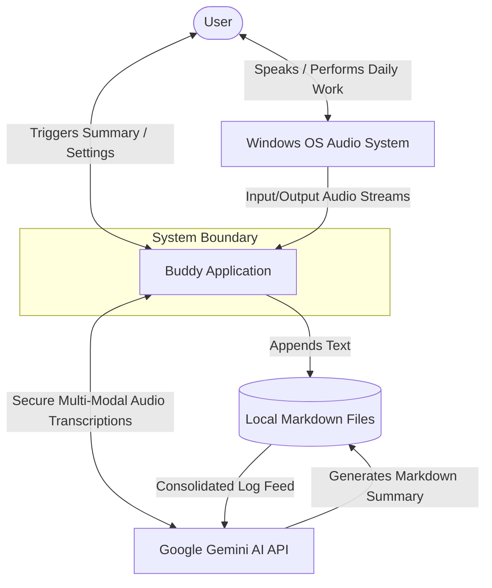
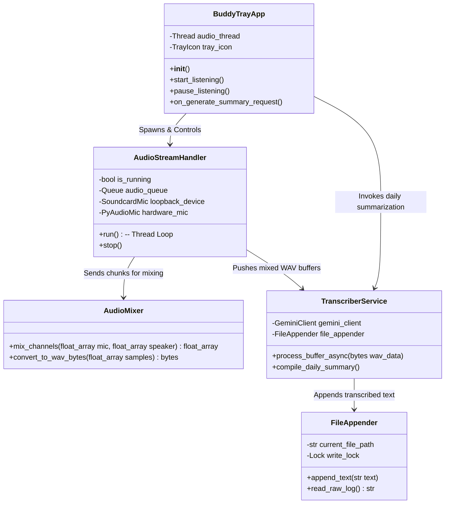

# System Design Specification (C4 Model)
## Project Name: Buddy
**Architectural Pattern:** C4 Architecture Model & Concurrent Threading  
**Author:** Antigravity (AI System Architect)  
**Status:** Design Approved  

---

## 1. Introduction

This document provides a highly detailed system design specification for **Buddy**, a continuous, passive background audio recorder and speech summarizer for Windows. This architecture is modeled after the **C4 software architecture model** to detail Context, Containers, Components, and Code interfaces, accompanied by a rigorous testing matrix designed for concurrent stream applications.

---

## 2. Level 1: System Context (C1)

The System Context diagram details how **Buddy** integrates with the user, local Windows hardware, and external services.



### System Context Entities
*   **User:** The primary operator. The user speaks naturally and participates in calls. They interact with Buddy only via the Windows System Tray menu to configure settings or generate summaries.
*   **Windows OS Audio System:** The underlying Core Audio / WASAPI layer, serving both microphone capture devices (Input) and active system playback devices (Loopback Output).
*   **Buddy Application:** The background software managing high-fidelity concurrent recording, transcription loop processing, and storage orchestration.
*   **Local Markdown Files:** Local files stored in the User's `~/.buddy/` folder that act as the persistent transcript log and synthesized daily summaries.
*   **Google Gemini AI API:** The remote AI model acting as the speech-to-text translator (for micro-buffers) and the daily summary synthesizer.

---

## 3. Level 2: Containers (C2)

The Container diagram decomposes the Buddy application boundary into executable, storage, and networking layers.

```mermaid
graph TB
    subgraph Client Workstation (Windows)
        subgraph Buddy App Process [Buddy Background Process]
            UI[Tray UI Container - PySide6]
            Engine[Audio Core Container - Threaded WASAPI]
            Client[AI Client Container - Gemini SDK]
        end
        
        Disk[(User Home .buddy Store)]
    end

    subgraph Remote Services
        Gemini[Google Gemini API]
    end

    %% Interactions
    UI -->|Launches & Monitors| Engine
    Engine -->|Accumulates In-Memory WAV Bytes| Client
    Client -->|Sends Micro-audio Buffers| Gemini
    Gemini -->|Returns UTF-8 Text| Client
    Client -->|Appends raw markdown log| Disk
    UI -->|Reads daily raw logs| Client
    Client -->|Sends entire raw log with summary prompt| Gemini
    Gemini -->|Returns Daily Summary markdown| Client
    Client -->|Writes final summary file| Disk
```

### Container Responsibilities
1.  **Tray UI Container (PySide6):** Manages the application lifecycle. Runs the main thread, renders system tray icons, binds context menus, displays Windows toast notifications, and spawns the audio recording background thread.
2.  **Audio Core Container (Threaded WASAPI):** An isolated, high-priority thread that loops continuously. It captures dual WASAPI audio (mic + loopback), mixes down the samples, converts them to standard WAV byte streams, and periodically hands them over to the AI Client.
3.  **AI Client Container (Gemini SDK / Keyring):** Manages credential retrieval from the Windows Credential Manager and coordinates API requests. It handles low-latency 30-second transcription requests and coordinates the end-of-day summary compilation.
4.  **User Home .buddy Store:** A hidden, centralized directory (`~/.buddy`) acting as the application database. It stores `config.json` for credentials, `YYYY-MM-DD_raw.md` for live appending, and `YYYY-MM-DD_summary.md` for summaries.

---

## 4. Level 3: Components (C3)

The Component diagram breaks down the internal elements of the **Buddy App Process**, showing how the classes and threads communicate safely.



### Thread Safety & Concurrency Model
To prevent GUI freezing and audio buffer drops, Buddy runs a multi-threaded architecture:
*   **Main GUI Thread:** PySide6 Event Loop. Handles system tray user interaction, clicks, setting changes, and Windows toast alerts.
*   **Audio Recording Thread:** High-priority, background worker thread running a continuous `while` loop. It collects WASAPI frame blocks from both devices synchronously to prevent buffer underruns.
*   **Transcription Worker Thread:** Spawns short-lived worker threads or uses QThreadPool to perform network HTTP requests to the Gemini API, ensuring transcription delays never interfere with the physical recording sample loops.
*   **File Locking (Mutex):** The `FileAppender` holds a thread-safe `Lock` (mutex) around the append-only raw Markdown file to guarantee that simultaneous thread write operations never cause race conditions or log corruption.

---

## 5. Level 4: Code Interfaces (C4)

The raw audio mixing and continuous transcription-append loops are defined by the following abstract Python interfaces:

### 5.1. Audio Stream Mixing Interface
```python
class AudioMixer:
    @staticmethod
    def mix_channels(mic_samples: np.ndarray, speaker_samples: np.ndarray) -> np.ndarray:
        """
        Pads and normalizes two audio signals to prevent clipping.
        Args:
            mic_samples (np.ndarray): Physical microphone audio frames (float32).
            speaker_samples (np.ndarray): WASAPI loopback speaker audio frames (float32).
        Returns:
            np.ndarray: Mixed single-channel or dual-channel normalized float32 array.
        """
        # Align lengths if mismatched due to different hardware capture rates
        max_len = max(len(mic_samples), len(speaker_samples))
        padded_mic = np.pad(mic_samples, (0, max_len - len(mic_samples)))
        padded_spk = np.pad(speaker_samples, (0, max_len - len(speaker_samples)))
        
        # Mix with standard normalization factor (0.5 to prevent digital clipping)
        mixed = (padded_mic * 0.5) + (padded_spk * 0.5)
        return mixed
```

### 5.2. Transcription Append Interface
```python
class FileAppender:
    def __init__(self, target_directory: str):
        self.directory = target_directory
        self._lock = threading.Lock()

    def append_transcription(self, text: str) -> None:
        """
        Appends a timestamped text block to the current day's raw markdown file safely.
        """
        date_str = datetime.now().strftime("%Y-%m-%d")
        timestamp_str = datetime.now().strftime("%H:%M:%S")
        file_path = os.path.join(self.directory, "transcripts", f"{date_str}_raw.md")

        with self._lock:  # Ensure single-thread write-access
            with open(file_path, "a", encoding="utf-8") as f:
                f.write(f"\n### [{timestamp_str}]\n{text.strip()}\n")
```

---

## 6. Comprehensive Testing Matrix

Buddy is designed as an always-on utility. This requires a robust testing framework to ensure continuous background operations.

### 6.1. Unit Testing Suite (Mocked Hardware & Network)
We use `pytest` and `unittest.mock` to assert internal module correctness:

```python
# test_audio_mixer.py
import numpy as np
from src.audio.mixer import AudioMixer

def test_mix_channels_normalization():
    # Arrange: Create two maximum amplitude signal arrays
    mic = np.ones(1000, dtype=np.float32)
    spk = np.ones(1000, dtype=np.float32)
    
    # Act: Mix channels
    result = AudioMixer.mix_channels(mic, spk)
    
    # Assert: Mixed signal should remain <= 1.0 (no clipping)
    assert np.max(result) <= 1.0
    assert len(result) == 1000
```

### 6.2. Integration Testing (Thread Safety & Disk I/O)
*   **Test Case I01: Concurrent Append Safety**
    *   *Mechanism:* Spawn 10 simultaneous threads, each attempting to append 100 transcript blocks to `FileAppender` simultaneously.
    *   *Assertion:* The resulting markdown file must contain exactly 1,000 blocks with perfect formatting, asserting that the thread `Lock` prevented file corruption or line overlaps.
*   **Test Case I02: Sliding Window FIFO Queue**
    *   *Mechanism:* Feed a steady stream of dummy audio buffers into the `AudioStreamHandler` queue.
    *   *Assertion:* Validate that the buffer is consumed correctly, cleared from memory, and doesn't expand memory usage (verifying zero memory leak in background stream capture).

### 6.3. Robustness & Robust Exception Testing (System Resiliency)
*   **Test Case R01: API Network Disconnect & Backoff Retry**
    *   *Simulation:* Simulate a loss of internet access mid-recording. Set the Gemini API connection client to raise a `ConnectionError`.
    *   *Expected Resiliency:* The transcription queue should hold the current 30-second WAV bytes in memory and initiate an **Exponential Backoff and Retry** routine (retrying at 2s, 4s, 8s, up to 60s) rather than losing the segment or crashing. Once connectivity is restored, the buffered audio is processed chronologically.
*   **Test Case R02: API Rate Limiting (HTTP 429)**
    *   *Simulation:* Mock the Gemini API returning an HTTP 429 Resource Exhausted status code.
    *   *Expected Resiliency:* The app catches the error, pauses outbound buffer dispatching, displays a subtle system tray tooltip warning the user of rate exhaustion, and automatically retries with a safe cooldown timer.
*   **Test Case R03: Core Audio Device Loss**
    *   *Simulation:* Force-disable the default recording speaker output device in Windows Device Manager while Buddy is actively recording.
    *   *Expected Resiliency:* The `soundcard` loopback thread catches the device disconnection exception, logs it, stops loopback capture cleanly, continues to record solely from the microphone, and triggers a Windows native balloon alert: *"Speaker capture device was disconnected. Recording continues on microphone only."*
*   **Test Case R04: Out-of-Disk-Space Exception**
    *   *Simulation:* Run the `FileAppender` on a partition configured with 0 bytes available.
    *   *Expected Resiliency:* Buddy handles the `OSError: [Errno 28] No space left on device` cleanly. It pauses the active recording loop, keeps the latest text in-memory, and notifies the user with a critical desktop warning: *"Buddy has run out of disk space. Transcriptions are paused."*
